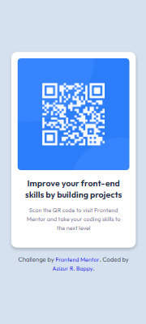

# Front-end Style Guide
This is a solution to the [QR code component challenge on Frontend Mentor](https://www.frontendmentor.io/challenges/qr-code-component-iux_sIO_H). Frontend Mentor challenges help you improve your coding skills by building realistic projects.

## 📚 Layout

The designs were created to the following widths:

- Mobile: 420px
- Desktop: 1440px

> 💡 These are just the design sizes. Ensure content is responsive and meets WCAG requirements by testing the full range of screen sizes from 320px to large screens.




## 🔗 Link
Solution Link: [QR Code Component](https://mebappy1.github.io/qr-code-component-frontend-mentor-solution)

## 🌈 Colors

 - Blue: #2c7dfa;
 - Blue Shade: #3685ff;
 - Dark Navy: #1f314f;
 - Grey: #7d889e;
 - Light Grey: #d5e1ef;
 - White: #ffffff;

**CSS** 
``` 
:root {
  --blue: #2c7dfa;
  --blueShade: #3685ff;
  --darkNavy: #1f314f;
  --grey: #7d889e;
  --lightGrey: #d5e1ef;
  --white: #ffffff;
}
```

## 🖊 Typography

### 📄 Body Copy
- Font size (paragraph): 15px

### 📝 Font
- Font Family: [Outfit](https://fonts.google.com/specimen/Outfit)
- Weights: 400, 700

> 💎 This is a free+ challenge. So, if you want to see all the design details and practice working with professional tools like Figma, you can download the design file from where you downloaded the starter code.

## 👨‍💼 Author
- Instagram - [Click Here](https://www.instagram.com/me.bappy1/)
- Linkedin - [Click Here](https://www.linkedin.com/in/mebappy1/)
- Frontend Mentor - [Click Here](https://www.frontendmentor.io/profile/mebappy1)
